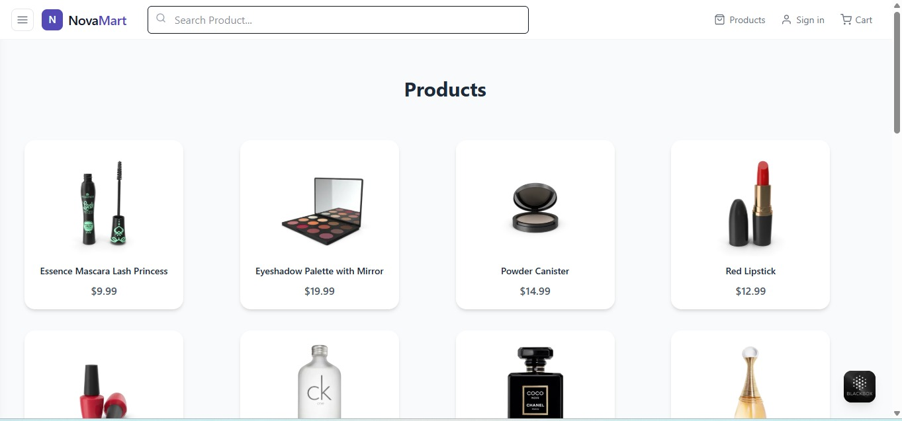
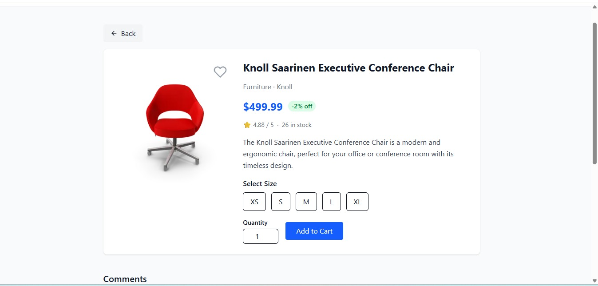
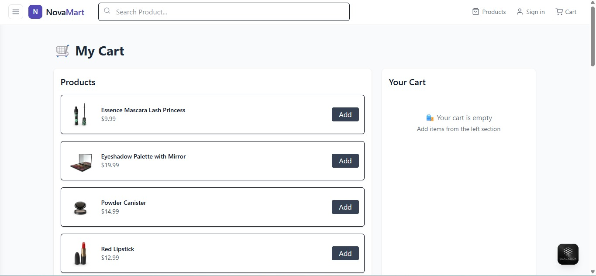
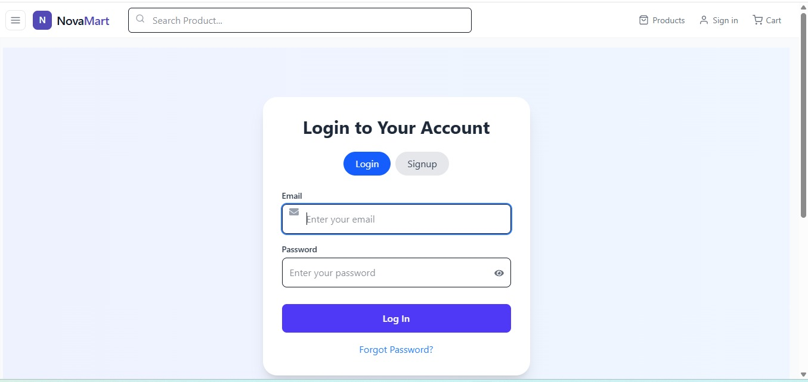
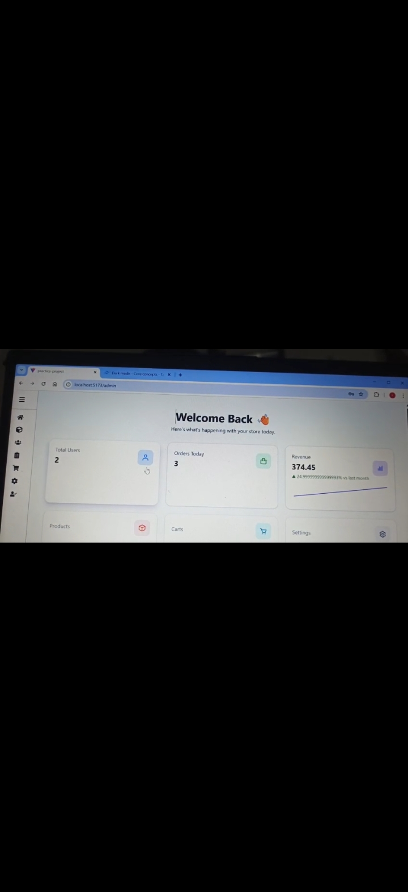

# 🛒 MERN Stack Ecommerce Website

[](https://github.com/Rameen-zahra2004/MERN-Stack-Ecommerce-Website)
[](https://www.mongodb.com/mern-stack)
[](LICENSE)

A full-featured Ecommerce web application built using the MERN Stack (MongoDB, Express.js, React.js, Node.js). This project includes user authentication, product management, shopping cart, order system, payment integration, admin dashboard, and responsive UI.

---

# 🚀 Live Demo

* Frontend: Coming Soon
* Backend API: Coming Soon

---

# 📌 Features

## 👤 User Features

* User Registration & Login
* JWT Authentication
* Product Search & Filtering
* Product Categories
* Product Details Page
* Add to Cart
* Wishlist
* Checkout System
* Order Tracking
* Payment Gateway Integration
* User Profile Management
* Responsive Design

## 🛠️ Admin Features

* Admin Dashboard
* Product CRUD Operations
* Category Management
* Order Management
* User Management
* Sales Analytics
* Stock Management

---

# 🧰 Tech Stack

## Frontend

* React.js
* Redux Toolkit
* React Router DOM
* Axios
* Tailwind CSS / Bootstrap
* Vite

## Backend

* Node.js
* Express.js
* MongoDB
* Mongoose
* JWT Authentication
* bcrypt.js
* Multer
* Cloudinary

---

# 📂 Folder Structure

```bash
EcommerceMERN/
│
├── frontend/
│   ├── src/
│   ├── public/
│   └── package.json
│
├── backend/
│   ├── controllers/
│   ├── models/
│   ├── routes/
│   ├── middleware/
│   ├── config/
│   ├── utils/
│   └── server.js
│
└── README.md
```

---

# ⚙️ Installation Guide

## 1️⃣ Clone Repository

```bash
git clone https://github.com/Rameen-zahra2004/MERN-Stack-Ecommerce-Website.git
cd MERN-Stack-Ecommerce-Website
```

---

## 2️⃣ Install Dependencies

### Backend

```bash
cd backend
npm install
```

### Frontend

```bash
cd frontend
npm install
```

---

# 🔑 Environment Variables

Create a `.env` file inside the backend folder.

```env
PORT=5000
MONGO_URI=your_mongodb_connection
JWT_SECRET=your_secret_key
NODE_ENV=development

CLOUDINARY_CLOUD_NAME=your_cloud_name
CLOUDINARY_API_KEY=your_api_key
CLOUDINARY_API_SECRET=your_api_secret

STRIPE_SECRET_KEY=your_stripe_secret
```

---

# ▶️ Run Project

## Backend

```bash
cd backend
npm run dev
```

## Frontend

```bash
cd frontend
npm run dev
```

---

# 🔐 Admin Access

You can manually create an admin in MongoDB.

Example Admin Document:

```json
{
  "name": "Admin",
  "email": "admin@gmail.com",
  "password": "hashedpassword",
  "role": "admin"
}
```

---

# 📸 Screenshots

## 🏠 Home Page



---

## 🛍️ Product Page



---

## 🛒 Cart Page



---

## 👤 Sign In Page



---

## ⚙️ Admin Dashboard


# 📦 API Endpoints

## Auth Routes

```bash
POST   /api/auth/register
POST   /api/auth/login
GET    /api/auth/profile
```

## Product Routes

```bash
GET    /api/products
GET    /api/products/:id
POST   /api/products
PUT    /api/products/:id
DELETE /api/products/:id
```

## Order Routes

```bash
POST   /api/orders
GET    /api/orders/myorders
GET    /api/orders/:id
```

---

# 🧪 Available Scripts

## Frontend

```bash
npm run dev
npm run build
npm run preview
```

## Backend

```bash
npm run dev
npm start
```

---

# 🌐 Deployment

## Frontend Deployment

* Vercel
* Netlify

## Backend Deployment

* Render
* Railway
* Cyclic

## Database

* MongoDB Atlas

---

# 🤝 Contributing

Contributions are welcome.

1. Fork the repository
2. Create a new branch
3. Commit your changes
4. Push to the branch
5. Open a Pull Request

---

# 📄 License

This project is licensed under the MIT License.

---

# 👩‍💻 Developer

**Rameen Zahra**

* Full Stack MERN Developer
* GitHub: [https://github.com/Rameen-zahra2004](https://github.com/Rameen-zahra2004)
* LinkedIn: Add Your LinkedIn Profile

---

# ⭐ Support

If you like this project, give it a ⭐ on GitHub.
